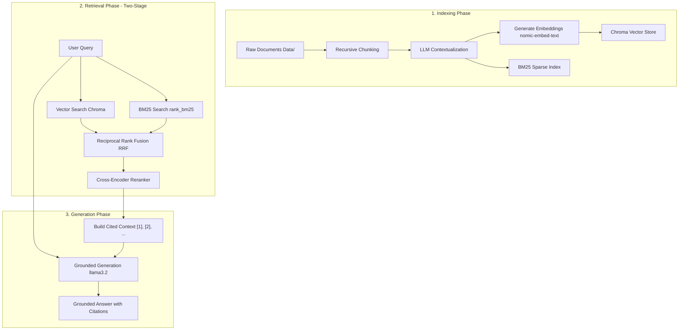

# IIT Madras RAG Tutorial 🚀

Watch it on [Youtube](https://www.youtube.com/live/BJs7JakDoIw?si=KPLFU0DDc5Iq7Sal) 


Welcome to the **IIT Madras RAG Tutorial** educational repository! This repository is designed as a milestone-based, step-by-step educational guide to building a production-grade, state-of-the-art **Retrieval-Augmented Generation (RAG)** pipeline.

Each milestone builds on the previous one, introducing a critical concept or optimization technique commonly used in modern RAG systems to improve search accuracy, document context retention, retrieval quality, and LLM groundedness.

---

## 🗺️ Milestone Progression Roadmap

The project transitions through 7 distinct milestones, each represented by a Git branch in this repository:

| Milestone / Branch | Focus | Key Concepts & Techniques | Added Files / Changes |
| :--- | :--- | :--- | :--- |
| **`Milestone-1`** | **Naive RAG** | Whole-document embedding, basic vector search using ChromaDB. | Initial setup, `document_loader.py`, `vector_store.py` |
| **`Milestone-2`** | **Text Chunking** | Splitting text into manageable chunks. Recursive paragraph chunking with fixed-size fallback and overlap. | `chunking.py`, updated `vector_store.py` |
| **`Milestone-3`** | **Late Chunking** | Blending local chunk embeddings with global document-level embeddings to preserve high-level semantic context. | `late_chunking.py`, updated `vector_store.py` |
| **`Milestone-4`** | **Contextual Retrieval** | Using an LLM to generate 1–2 sentences of document context and prepending it to each chunk prior to embedding. | `contextual_retrieval.py`, `llm_calls.log` setup |
| **`Milestone-5`** | **Hybrid Search** | Combining Dense Vector search with Sparse Keyword search (BM25) and merging ranks using Reciprocal Rank Fusion (RRF). | `hybrid_search.py`, chunk cache index lookup |
| **`Milestone-6`** | **Cross-Encoder Reranking** | Implementing a two-stage retrieval pipeline: retrieve a larger candidate pool via hybrid search, then reorder using a Cross-Encoder model. | `reranker.py` |
| **`Milestone-7`** | **Grounded Generation** | Instructing the LLM to generate answers grounded *only* in retrieved context, outputting strict source citations. | `grounded_generation.py`, final `app.py` integration |

---

## 🏗️ Architecture & Pipeline Flow (Final Milestone)

The final state of the repository (**Milestone-7**) implements a complete two-stage hybrid RAG pipeline with contextual chunking and citation-grounded generation:



---

## 📂 Project Structure

```directory
├── Data/                       # Knowledge base documents (txt format) and images
│   ├── 01_perseverance.txt
│   ├── 02_curiosity.txt
│   └── ...
├── src/                        # Core codebase
│   ├── app.py                  # Main entry point (interactive CLI terminal)
│   ├── chunking.py             # Fixed-size and recursive text chunking algorithms
│   ├── contextual_retrieval.py # LLM-based chunk contextualization
│   ├── document_loader.py      # Local file loading utilities
│   ├── grounded_generation.py  # LLM citation and grounding prompts
│   ├── hybrid_search.py        # BM25 indexing and Reciprocal Rank Fusion (RRF)
│   ├── late_chunking.py        # Segment embedding blending helper (Milestone-3)
│   ├── llm_client.py           # Ollama client interface and telemetry logging
│   ├── reranker.py             # Sentence-transformers Cross-Encoder reranker
│   └── vector_store.py         # ChromaDB persistence, indexing, and query pipeline
├── eval_set.json               # Benchmark dataset with questions and ground truth
├── pyproject.toml              # Project dependencies and metadata
└── README.md                   # You are here!
```

---

## ⚙️ Setup & Installation

### 1. Prerequisites
- **Python**: Version `3.14` or later is recommended.
- **Ollama**: Required for running the local LLM and embedding model.

### 2. Install & Start Ollama
Ensure [Ollama](https://ollama.com/) is installed and running, then pull the required models:

```bash
# Pull the embedding model
ollama pull nomic-embed-text

# Pull the generation model
ollama pull llama3.2
```

### 3. Clone and Setup Environment
You can manage dependencies easily using `uv` or standard virtual environments:

```bash
# Clone the repository (and checkout the final milestone branch if needed)
git checkout Milestone-7

# Create and activate a virtual environment
uv venv
source .venv/bin/activate

# Install the dependencies
uv pip install -e .
```

If using standard `pip`, install directly:
```bash
pip install -r pyproject.toml
```

---

## 🚀 How to Run

Run the interactive terminal app to start questioning the system:

```bash
python src/app.py
```

### Example Usage:
```text
Ask a question : Which Mars rover is responsible for collecting and caching rock samples?

Grounded Answer

The Perseverance rover is responsible for collecting and caching rock samples for the planned Mars Sample Return campaign [1].

Retrieved Documents

----- Document 1: 01_perseverance -----
[LLM Contextualization Context...]
Perseverance's primary mission focuses on astrobiology and geological exploration of Jezero Crater...
```

---

## 🧪 Evaluation Set

An evaluation set is provided in [eval_set.json](eval_set.json) containing 6 high-quality multi-hop and single-hop questions, reference sources, and ground-truth answers. You can use these questions to verify how each milestone's additions improve the quality of retrieval:
- Compare vector-only search (Milestone-2) vs. Contextual Retrieval (Milestone-4) on detail-heavy questions.
- Benchmark how hybrid search and cross-encoder reranking (Milestone-6) help retrieve documents that require matching both exact keywords and semantic ideas.
